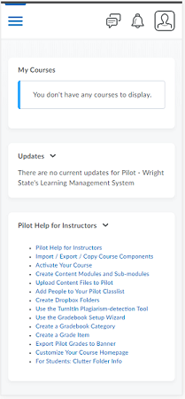
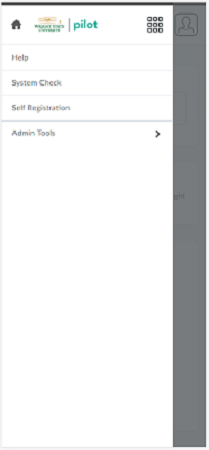
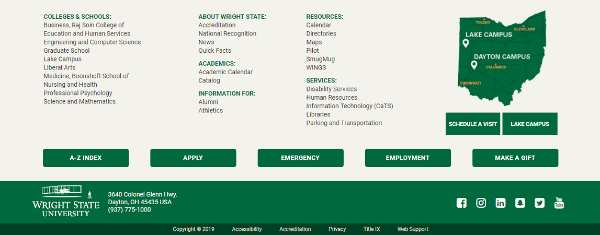

The User Interface was designed to feel both familiar and functional.
The design pulls its inspiration from many common mobile applications.
It has a static header and footer with dynamic content in the middle.
Additional content is brought into view by means of a side loading menu.

# Pilot Main View                                  

# Pilot with Side Viewer Open

# Footer Example from Wright.edu

     